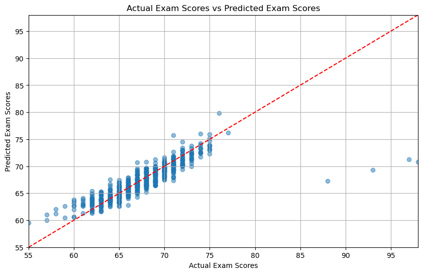
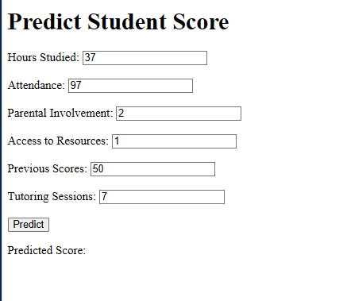

### Predicting the Student's Performance with utilization of Tensorflow 2.x with GPU Support.
This project demonstrates how to use TensorFlow 2.0 with GPU support to create a Convolutional Neural Network (CNN) model for predicting Student Performance based on various factors. We will use the dataset "Student Performance Factors" by lainguyn123 fron Kaggle and preprocess the dataset. From there we can apply Machine Learning Algorithms into the model and create a showcase simple website.

# Datasets
Datasetes used is "Student Performance Factors" by lainguyn123. Datasets which will be used contains 6607 data of student performances. This dataset provides a comprehensive overview of various factors affecting student performance in exams. It includes information on study habits, attendance, parental involvement, and other aspects influencing academic success. You can access the datasets [here](https://www.kaggle.com/datasets/lainguyn123/student-performance-factors) in Kaggle

There are several attributes/features, each explains the data/value of each students with one value of "Exam_Score" being the target of observation.

- Hours_Studied: Weekly study hours.
- Attendance: Class attendance percentage.
- Parental_Involvement: Parental involvement in education (Low, Medium, High).
- Access_to_Resources: Availability of educational resources (Low, Medium, High).
- Extracurricular_Activities: Participation in extracurriculars (Yes, No).
- Sleep_Hours: Average nightly sleep (in hours).
- Previous_Scores: Scores from previous exams.
- Motivation_Level: Motivation level (Low, Medium, High).
- Internet_Access: Availability of internet access (Yes, No).
- Tutoring_Sessions: Monthly tutoring sessions.
- Family_Income: Family income level (Low, Medium, High).
- Teacher_Quality: Quality of teaching (Low, Medium, High).
- School_Type: Type of school (Public, Private).
- Peer_Influence: Influence of peers (Positive, Neutral, Negative).
- Physical_Activity: Weekly hours of physical activity.
- Learning_Disabilities: Presence of learning disabilities (Yes, No).
- Parental_Education_Level: Highest parental education (High School, College, Postgraduate).
- Distance_from_Home: Distance to school (Near, Moderate, Far).
- Gender: Gender of the student (Male, Female).
- Exam_Score: Final exam score.

Dataset Utilization includes Preprocessing the data by discarding unimportant or disruptive attribute and normalizing the data to achieve better results. Data will be split for Train/Valid/Test purposes with split ratio of 80%/10%/10%.


# Model Architecture
For this project, we use a Convolutional Neural Network (CNN) model to classify stars based on the features provided in the dataset.
The input data is reshaped to fit the CNN requirements. The model also utilizzes the early stopping method to recognize signs of Potential Overfitting within the model and prevent such actions by stopping the model training.

# Result
.
.
### How to use this Project
Buat sendiri python env sendiri terlebih dahulu.
```
$ python3 -m venv env
```
Install berbagai library yang digunakan. Jika kesulitan dalam donwload langsung library requirement, cek satu per satu versi ayng digunakan.
```
$ pip install -r requirements.txt
```
- Jangan Lupa untuk menjalankan performance_preprocessing.ipynb serta performance_model.ipynb terlebih dahulu

Jalankan program app.py
```
$ python app.py
```
Kita akan diberikan link local untuk pengoperasian aplikasi website.


#License
This project/code is publised under MIT License.